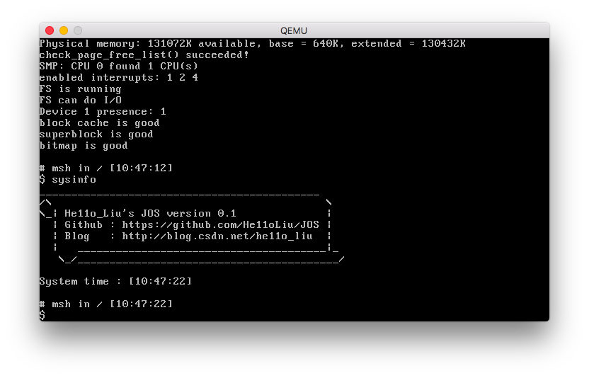
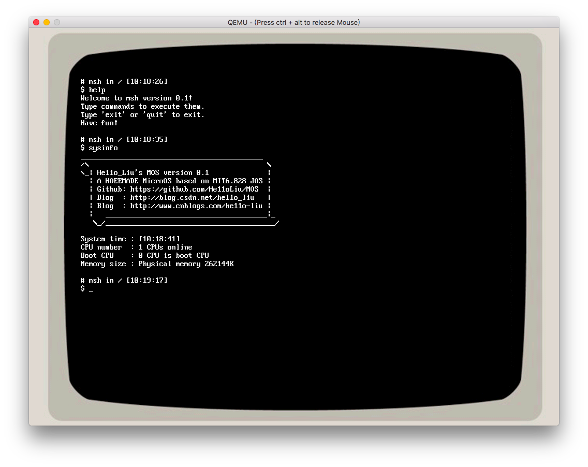

# Micro homemade OS

`MOS`是一个基于`MIT 6.828 JOS`的自制操作系统。在完成`JOS`实验的基础上添加了很多新特性，并提供了基础的图形界面与应用程序接口。关于此操作系统的详细设计与实现文档见`./documents`。


## CGA 显示界面



## 图像显示界面

在启动后`msh`中输入`$ applauncher`启动图形化界面应用启动器

```shell
====Graph mode on====
   scrnx  = 1024
   scrny  = 768
MMIO VRAM = 0xef800000
=====================
SMP: CPU 0 found 1 CPU(s)
enabled interrupts: 1 2 4
FS is running
FS can do I/O
Device 1 presence: 1
block cache is good
superblock is good
bitmap is good

# msh in / [10:02:07]
$ applauncher
```





## 环境

需要配置`/conf/env.mk`下的`qemu`所在路径

```shell
$ i386-elf-gcc -v
使用内建 specs。
COLLECT_GCC=i386-elf-gcc
COLLECT_LTO_WRAPPER=/opt/local/libexec/gcc/i386-elf/4.7.2/lto-wrapper
目标：i386-elf
配置为：/opt/local/var/macports/build/_opt_local_var_macports_sources_rsync.macports.org_macports_release_tarballs_ports_cross_i386-elf-gcc/i386-elf-gcc/work/gcc-4.7.2/configure --prefix=/opt/local --target=i386-elf --infodir=/opt/local/share/info --mandir=/opt/local/share/man --datarootdir=/opt/local/share/i386-elf-gcc --with-system-zlib --with-gmp=/opt/local --with-mpfr=/opt/local --with-mpc=/opt/local --enable-stage1-checking --enable-multilib --with-newlib --enable-languages=c,c++
线程模型：single
gcc 版本 4.7.2 (GCC)
$ /usr/local/Cellar/qemu/2.10.0/bin/qemu-system-i386 -version
QEMU emulator version 2.10.0
Copyright (c) 2003-2017 Fabrice Bellard and the QEMU Project developers
```

`MIT`课程中使用`linux`的环境，这里配置了`macOS`下的开发环境。

具体配置方法见`./documents/[finish] macOS编译运行配置.md`


## MIT6.828 JOS lab 完成列表

- [x] lab1 Booting a PC
- [x] lab1 challenge: VGA GUI
- [x] lab2 Memory Management
- [x] lab2 challenge
- [x] lab3 User Environments
- [x] lab3 challenge: single step debug
- [x] lab4 Preemptive Multitasking
- [ ] lab4 challenge
- [x] Lab 5: File system, Spawn and Shell
- [ ] lab5 challenge


## 实验中已支持的特性

- 段页式内存管理 （详见`\lab_record\lab2.md`）
- 支持进程(`Environments`)
  - 进程切换
  - 进程间通讯，通过`syscall`实现
  - 进程单独地址空间
  - `spawn`创建进程，`fork`使用`Read Copy Update`策略
  - 支持抢断式任务调度
- 支持多核`CPU`
  - 支持`IPI`，提供`IPI`接口
  - 支持大内核锁（基于自旋锁）
- 系统服务`syscall`
  - 打印字符
  - 获取字符
  - 获取进程编号
  - 回收进程
  - 主动调度
  - `fork`
  - 设置进程状态
  - 申请页，映射页，取消映射
  - **用户空间页错误处理入口设置**
  - `IPC`进程间通讯
  - 用户空间异常处理栈设置
- 支持页错误用户空间处理
- 支持简易文件系统 （CS结构）
- 支持文件描述符
- 支持`pipe`
- 用户空间工具
  - `sh`简易`shell`


## 新特性

- 支持原子操作
- 支持读写锁
- 支持针对单一核心`IPI`
- 支持`PRWLock`
- 支持基本图形显示
- 支持中英文显示（中英文点阵字库）
- 支持进程工作目录 提供`getcwd`与`chdir`
- 新的`syscall`
  - `SYS_env_set_workpath` 修改工作路径
- 新的用户程序
  - `ls` 功能完善
  - `pwd` 输出当前工作目录
  - `cat` 接入工作目录
  - `touch` 由于文件属性没啥可改的，用于创建文件
  - `mkdir` 创建目录文件
  - `msh` 更高级的`shell` 还未完全完工 支持`cd` 支持默认二进制路径为 `bin`
- 调整目标磁盘生成工具
- 支持从RTC读取时间
- 支持`kmalloc/kfree`，支持分配连续空间
- 提供`RW/RW`用户内核共享`framebuffer/palette`
- 提供用户`GUI`接口
- 提供调色板预设
- 提供`Applauncher`
  - 日历应用
  - 系统信息应用
  - 模拟`CGA`显示模式的终端程序（基于`pipe`)

  ​

## 计划完成的特性

- `mmap`